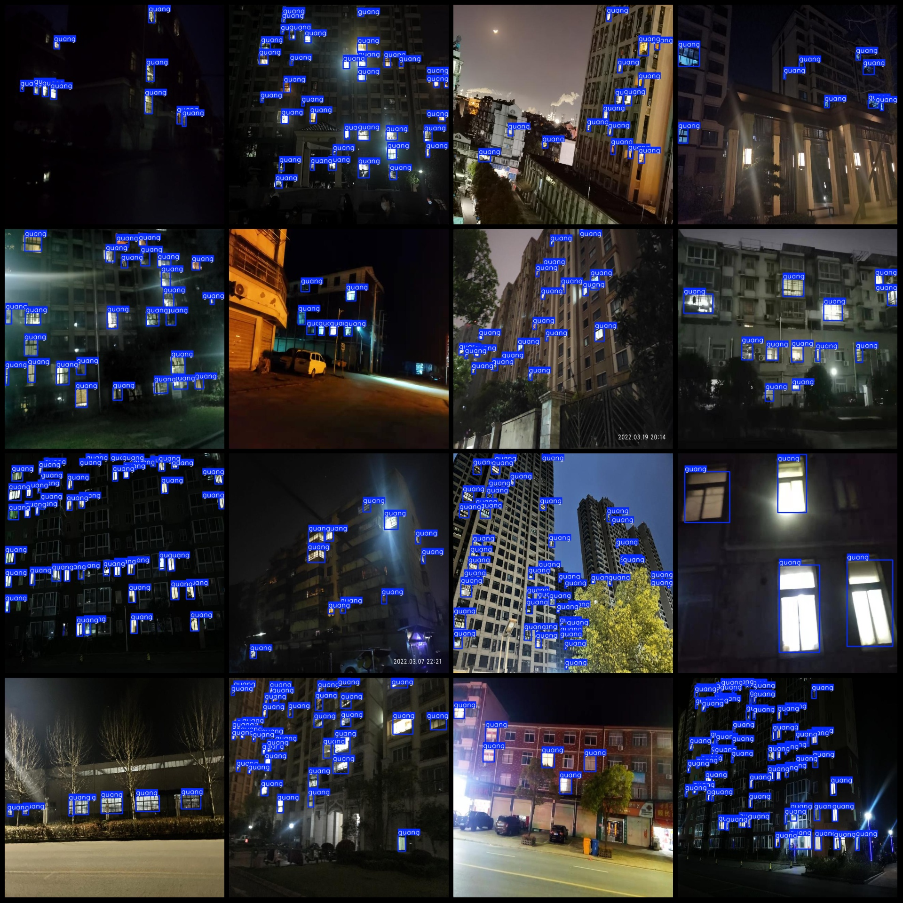
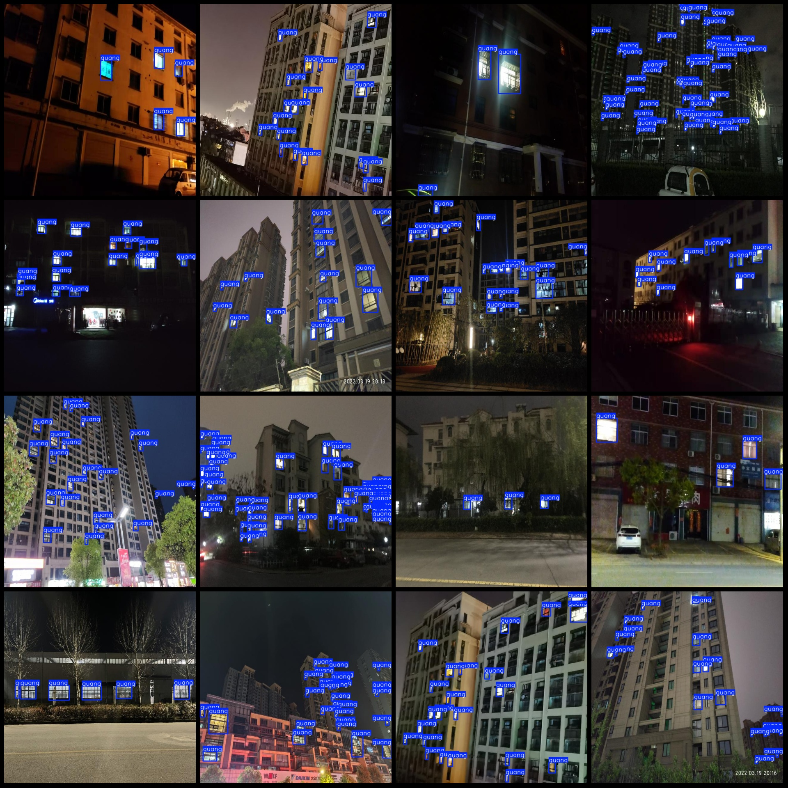

# Nighttime Buildings Lighting Detection Dataset in VOC+YOLO Format with 998 Images and 1 Category

The dataset format: Pascal VOC format + YOLO format (txt file without split path, only containing jpg images along with corresponding VOC format xml files and YOLO format txt files).
Number of images (jpg file count): 998
Number of annotations (xml file count): 998
Number of annotations (txt file count): 998
Number of annotation categories: 1
Annotation category name: ["guang"]
Number of bounding boxes per category:
guang = 23132
Total bounding boxes: 23132
Number of images each category occupies:
guang = 998
Image resolution: 640x640
Annotation tool used: labelImg
Annotation rule: draw a rectangle around the category
Important note: The dataset does not have separate training, validation, or test sets. You will need to manually divide them yourself.
Special declaration: This dataset does not guarantee the accuracy of the trained model or weight files.
Image preview:
Annotation example:

## Images

Here is a pay link on Stripe ( https://buy.stripe.com/3cs8yP7sY87d0vu9AB ). Please contact me lonlonago@foxmail.com after funding $89, and I will send you a complete data files , thank you!

